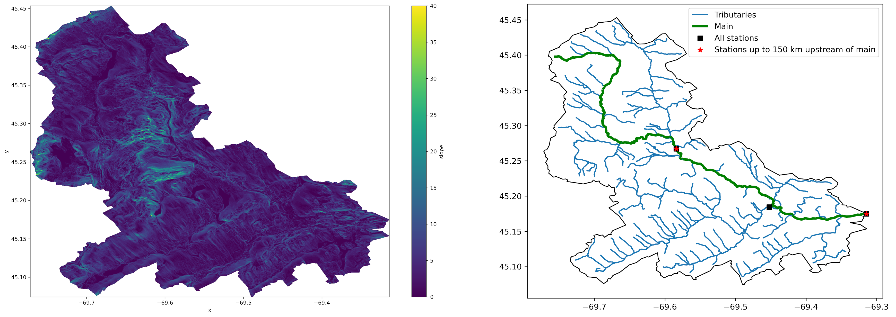

|

=========== ===========================================================================
Package     Description
=========== ===========================================================================
Hydrodata_  Access NWIS, HCDN 2009, NLCD, and SSEBop databases
PyGeoOGC_   Query data from any ArcGIS RESTful-, WMS-, and WFS-based services
PyGeoUtils_ Convert responses from PyGeoOGC's supported web services to datasets
PyNHD_      Access NLDI and WaterData web services for navigating the NHDPlus database
Py3DEP_     Access topographic data through the 3D Elevation Program (3DEP) web service
PyDaymet_   Access the Daymet database for daily climate data
=========== ===========================================================================

.. _Hydrodata: https://github.com/cheginit/hydrodata
.. _PyGeoOGC: https://github.com/cheginit/pygeoogc
.. _PyGeoUtils: https://github.com/cheginit/pygeoutils
.. _PyNHD: https://github.com/cheginit/pynhd
.. _Py3DEP: https://github.com/cheginit/py3dep
.. _PyDaymet: https://github.com/cheginit/pydaymet

Hydrodata: Portal to hydrology and climatology data
===================================================

.. image:: https://img.shields.io/pypi/v/hydrodata.svg
    :target: https://pypi.python.org/pypi/hydrodata
    :alt: PyPi

.. image:: https://img.shields.io/conda/vn/conda-forge/hydrodata.svg
    :target: https://anaconda.org/conda-forge/hydrodata
    :alt: Conda Version

.. image:: https://pepy.tech/badge/hydrodata
    :target: https://pepy.tech/project/hydrodata
    :alt: Downloads

.. image:: https://github.com/cheginit/hydrodata/workflows/build/badge.svg
    :target: https://github.com/cheginit/hydrodata/actions?query=workflow%3Abuild
    :alt: Github Actions

.. image:: https://mybinder.org/badge_logo.svg
    :target: https://mybinder.org/v2/gh/cheginit/hydrodata/master?urlpath=lab/tree/docs/examples
    :alt: Binder

.. image:: https://zenodo.org/badge/237573928.svg
    :target: https://zenodo.org/badge/latestdoi/237573928
    :alt: Zenodo

|

🚨 **This package is under heavy development and breaking changes are likely to happen.** 🚨

Why Hydrodata?
==============

Hydrodata is a stack of Python libraries designed to aid in watershed analysis through
web services. Currently, it only includes hydrology and climatology data within the US.
Some of the major capabilities of Hydrodata are:

* Easy access to many web services for subsetting data and returning them as masked xarrays
  or GeoDataFrames.
* Splitting the requests into smaller chunks under-the-hood since web services limit
  the number of items per request. So the only bottleneck for subsetting the data
  is the local available memory.
* Navigating and extracting data from the NHDPlus database using web services without
  downloading the whole database.
* Cleaning up the vector NHDPlus data, fixing some common issues, and computing flow accumulation.
* A URL inventory of some of the popular web services.
* Many other utilities for manipulating the data and visualization.

You can visit `examples <https://hydrodata.readthedocs.io/en/develop/examples.html>`__
webpage to see some example notebooks. You can also try using Hydrodata without installing
it on you system by clicking on the binder badge below the Hydrodata banner. A Jupyter notebook
instance with the Hydrodata software stack pre-installed will be launched in your web browser
and you can start coding!

Features
========

Hydrodata itself has three main modules; ``hydrodata``, ``plot``, and ``helpers``.
The ``hydrodata`` module provides access to the following web services:

* `NWIS <https://nwis.waterdata.usgs.gov/nwis>`__ for daily mean streamflow observations,
* `HCDN 2009 <https://www2.usgs.gov/science/cite-view.php?cite=2932>`__ for identifying sites
  where human activity affects the natural flow of the watercourse,
* `NLCD 2016 <https://www.mrlc.gov/>`__ for land cover/land use, imperviousness, and canopy data,
* `SSEBop <https://earlywarning.usgs.gov/ssebop/modis/daily>`__ for daily actual
  evapotranspiration, for both single pixel and gridded data.

Also, it has two other functions:

* ``interactive_map``: Interactive map for exploring USGS stations within a bounding box.
* ``cover_statistics``: Compute categorical statistics of land use/land cover data.

The ``plot`` module includes two main functions:

* ``signatures``: Plot five hydrologic signature graphs
* ``cover_legends``: The official NLCD land cover legends for plotting a land cover dataset.

The ``helpers`` module include:

* ``nlcd_helper``: A roughness coefficients lookup table for each land cover type which is
  useful for overland flow routing among other applications.
* ``nwis_error``: A dataframe for finding information about NWIS requests' errors.

Moreover, requests for additional databases or functionalities can be submitted via
`issue tracker <https://github.com/cheginit/hydrodata/issues>`__.

Documentation
=============

.. toctree::
    :maxdepth: 1
    :caption: Getting Started

    installation
    examples

.. toctree::
    :maxdepth: 1
    :caption: Help & Reference

    history
    modules
    contributing
    authors
    license
