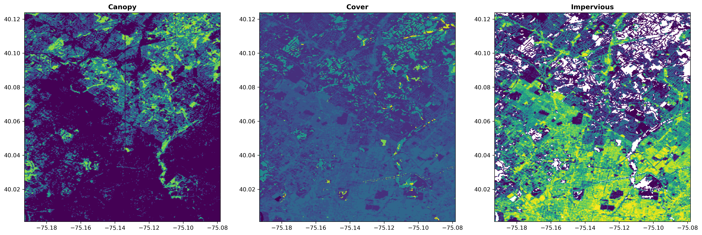
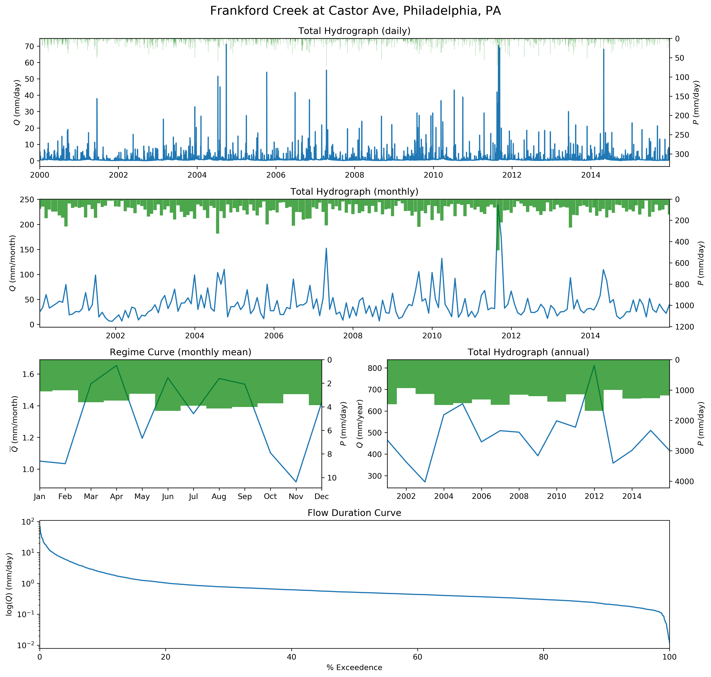
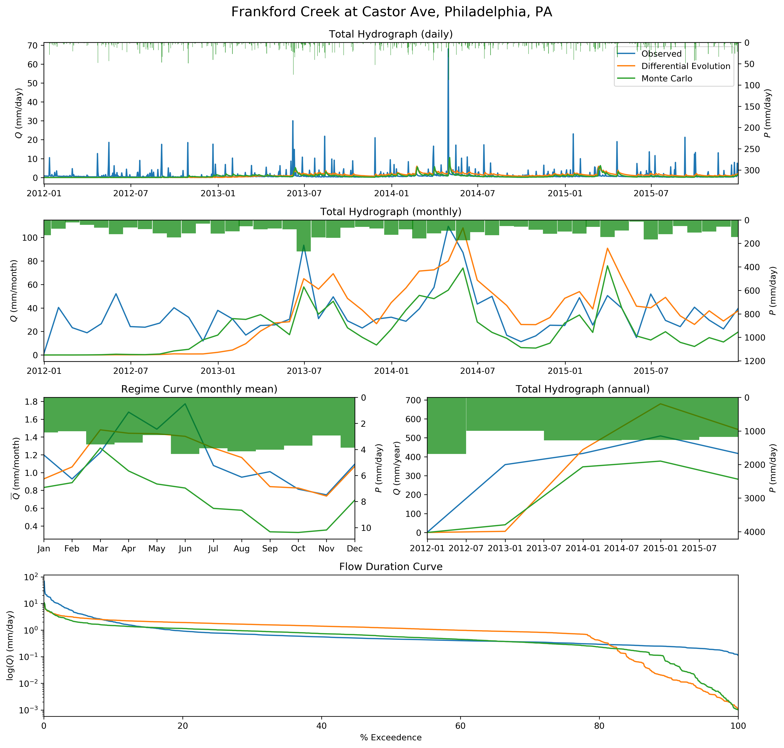
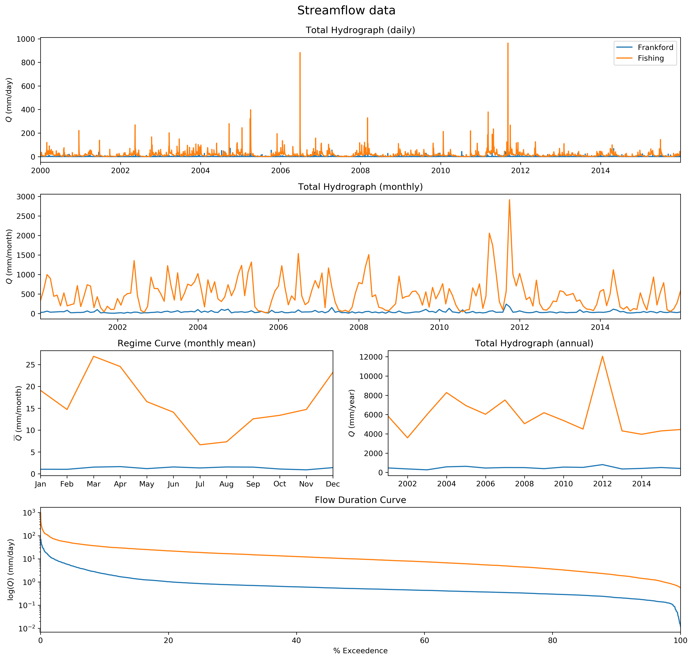

Usage
==================

.. code:: python

    from hydrodata import Dataloader

Hydrodata module downloads daily climate data for a USGS station based
its ID or coordinates (longitude and latitude). It requires at least
three parameters: start date, end date and USGS station ID or
coordinates. The daily climate data are downloaded from the
`Daymet <https://daymet.ornl.gov/>`__ and
`NWIS <https://nwis.waterdata.usgs.gov/nwis>`__ datasets.

Climate Data
------------

For example, let’s consider the following USGS station:

.. code:: python

    start, end = '2000-01-01', '2015-12-31'
    station_id = '01467087'

Now, we can define an instance based on the station ID as follows:

.. code:: python

    frankford = Dataloader(start, end, station_id=station_id)

.. code-block:: bash

    NHDPlusV21_NationalData_GageInfo_05.7z: 0.00B [00:00, ?B/s]
    Downloading USGS gage information data to gis_data
    NHDPlusV21_NationalData_GageInfo_05.7z: 729kB [00:00, 1.32MB/s]
    NHDPlusV21_NationalData_GageLoc_05.7z: 0.00B [00:00, ?B/s]
    Successfully downloaded and extracted gis_data/NHDPlusV21_NationalData_GageInfo_05.7z.
    NHDPlusV21_NationalData_GageLoc_05.7z: 1.14MB [00:00, 1.85MB/s]
    Successfully downloaded and extracted gis_data/NHDPlusV21_NationalData_GageLoc_05.7z.
    The gauge station is located in the following watershed:
    Frankford Creek at Castor Ave, Philadelphia, PA

Upon instantiation, the station’s information is found from NHDPlus V2
dataset. NHDPlus is automatically downloaded and unzipped. The climate
data can be downloaded using ``get_climate`` function. The data is
downloaded and saved as an HDF5 file. If the file exists, it is read
from the disk.

.. code:: python

    frankford.get_climate()

.. code-block:: bash

    Downloading climate data from the Daymet database
    Computing potential evapotranspiration (PET) using FAO method
    Downloading stream flow data from USGS database
    climate data was downloaded successfuly andsaved to data/4489096/20000101_20151231.h5

The data is returned as a ``pandas`` dataframe.

.. code:: python

    frankford.climate.head()

.. raw:: html

    

    
    <table border="1" class="dataframe">
      <thead>
        <tr style="text-align: right;">
          <th></th>
          <th>prcp (mm/day)</th>
          <th>tmin (C)</th>
          <th>tmax (C)</th>
          <th>tmean (C)</th>
          <th>pet (mm)</th>
          <th>qobs (cms)</th>
        </tr>
      </thead>
      <tbody>
        <tr>
          <th>2000-01-01</th>
          <td>0.0</td>
          <td>-2.5</td>
          <td>8.5</td>
          <td>3.0</td>
          <td>0.95</td>
          <td>0.453070</td>
        </tr>
        <tr>
          <th>2000-01-02</th>
          <td>0.0</td>
          <td>1.5</td>
          <td>16.5</td>
          <td>9.0</td>
          <td>1.55</td>
          <td>0.453070</td>
        </tr>
        <tr>
          <th>2000-01-03</th>
          <td>0.0</td>
          <td>8.5</td>
          <td>17.5</td>
          <td>13.0</td>
          <td>1.23</td>
          <td>0.453070</td>
        </tr>
        <tr>
          <th>2000-01-04</th>
          <td>18.0</td>
          <td>9.0</td>
          <td>19.0</td>
          <td>14.0</td>
          <td>1.39</td>
          <td>4.955448</td>
        </tr>
        <tr>
          <th>2000-01-05</th>
          <td>0.0</td>
          <td>0.0</td>
          <td>13.0</td>
          <td>6.5</td>
          <td>1.32</td>
          <td>1.387525</td>
        </tr>
      </tbody>
    </table>
    

Hydrodata has function that can separate snow and rain from the
precipitation.

.. code:: python

    df = frankford.climate.copy()
    df["pr (mm/day)"], df["ps (mm/day)"] = frankford.separate_snow(
        df["prcp (mm/day)"].values,
        df["tmean (C)"].values,
        tcr=0)
    df.head()

.. raw:: html

    

    
    <table border="1" class="dataframe">
      <thead>
        <tr style="text-align: right;">
          <th></th>
          <th>prcp (mm/day)</th>
          <th>tmin (C)</th>
          <th>tmax (C)</th>
          <th>tmean (C)</th>
          <th>pet (mm)</th>
          <th>qobs (cms)</th>
          <th>pr (mm/day)</th>
          <th>ps (mm/day)</th>
        </tr>
      </thead>
      <tbody>
        <tr>
          <th>2000-01-01</th>
          <td>0.0</td>
          <td>-2.5</td>
          <td>8.5</td>
          <td>3.0</td>
          <td>0.95</td>
          <td>0.453070</td>
          <td>0.0</td>
          <td>0.0</td>
        </tr>
        <tr>
          <th>2000-01-02</th>
          <td>0.0</td>
          <td>1.5</td>
          <td>16.5</td>
          <td>9.0</td>
          <td>1.55</td>
          <td>0.453070</td>
          <td>0.0</td>
          <td>0.0</td>
        </tr>
        <tr>
          <th>2000-01-03</th>
          <td>0.0</td>
          <td>8.5</td>
          <td>17.5</td>
          <td>13.0</td>
          <td>1.23</td>
          <td>0.453070</td>
          <td>0.0</td>
          <td>0.0</td>
        </tr>
        <tr>
          <th>2000-01-04</th>
          <td>18.0</td>
          <td>9.0</td>
          <td>19.0</td>
          <td>14.0</td>
          <td>1.39</td>
          <td>4.955448</td>
          <td>18.0</td>
          <td>0.0</td>
        </tr>
        <tr>
          <th>2000-01-05</th>
          <td>0.0</td>
          <td>0.0</td>
          <td>13.0</td>
          <td>6.5</td>
          <td>1.32</td>
          <td>1.387525</td>
          <td>0.0</td>
          <td>0.0</td>
        </tr>
      </tbody>
    </table>
    

Moreover, longitude and latitude coordinate can also be used for
downloading the data. The coordinate doesn’t have to be exact since the
closest station to the specified coordinates is found automatically. For
example, let’s find the climate data for a station close to longitude
-76.43 and latitude of 41.08.

.. code:: python

    fishing = Dataloader(start, end, coords=(-76.43, 41.08))
    fishing.get_climate()

.. code-block:: bash

    The gage station is located in the following watershed:
    Fishing Creek near Bloomsburg, PA
    Downloading climate data from the Daymet database
    Computing potential evapotranspiration (PET) using FAO method
    Downloading stream flow data from USGS database
    climate data was downloaded successfuly andsaved to data/2603023/20000101_20151231.h5

Land Use, Land Cover Data
-------------------------

Also, if geometry of a watershed as a ``shapefile`` is availble, the
``get_lulc`` function downloads land use land cover (LULC) data from the
National Land Cover Database (NLCD) 2016 dataset. The data will be saved
as a ``geotiff`` file and will be read from the disk if it’s downloaded
previousely.

In order to download the shapefile the watershed upstream of the USGS
stations an R script, ``nhdplus.R``, is provided in
`hydrodata <https://github.com/cheginit/hydrodata>`__ Github repository.
First, open up a new terminal, then load the Anaconda framework and
create an R enviroment as follows:

.. code:: bash

   conda create -n nhdplus -c conda-forge r-rgdal r-sf r-curl r-httr r-prettymapr r-rosm r-optparse r-geojsonio && \
   conda activate nhdplus && \
   Rscript -e \
   "options(repos = 'https://cran.revolutionanalytics.com'); \
   install.packages('nhdplusTools');"

Next, run the script and pass the station ID (or the station
coordinates) to the script;

.. code:: bash

   ./nhdplus.R -i 01467087

It automatically downloads the watershed geometry as a ``shapefile`` and
plots it including its river network (main and tributaries) and save the
plot as a ``png`` file. The ``shapefile`` is saved in the directory that
is passed to the script (default is ``gis_data``) under a directory
named the (starting) ComID (Common identifier of an NHDFlowline feature)
of the watershed. In this example the path is
``gis_dir/4489096/geometry.shp``. Running ``./nhdplus.R -h`` shows more
information about the script options.

Now the ``get_lulc`` function can be used to download the LULC data.
This function has an optional argument for providing the path to the
watershed geometry. The default is the same as the R script which in
this example is ``gis_dir/4489096/geometry.shp``.

.. code:: python

    frankford.get_lulc()

.. code-block:: bash

    Downloadin impervious data from NLCD 2016 database
    impervious data was downloaded successfuly and saved to {data}
    Downloadin cover data from NLCD 2016 database
    cover data was downloaded successfuly and saved to {data}
    Downloadin canopy data from NLCD 2016 database
    canopy data was downloaded successfuly and saved to {data}

.. code:: python

    import rasterio
    from rasterio.plot import show
    import matplotlib.pyplot as plt

.. code:: python

    canopy = rasterio.open(frankford.data_dir.joinpath('canopy.geotiff'))
    cover = rasterio.open(frankford.data_dir.joinpath('cover.geotiff'))
    impervious = rasterio.open(frankford.data_dir.joinpath('impervious.geotiff'))

    fig, (ax1, ax2, ax3) = plt.subplots(1, 3, figsize=(21, 7), dpi=300)
    show(canopy, ax=ax1, title='Canopy')
    show(cover, ax=ax2, title='Cover')
    show(impervious, ax=ax3, title='Impervious');

Plotting
--------

The hydrologic signatures can be plotted easily using the ``plot`` and
``plot_discharge`` functions. These functions convert the streamflow
data from cubic meter per second to millimeter per day based on the
watershed area which should be provided in km\ :math:`^2`. The function
are written with three use cases in mind that are demonstrated below.

Observed discharge for a station
~~~~~~~~~~~~~~~~~~~~~~~~~~~~~~~~

In this case, the ``plot`` function can simply be called for any
Hydrodata instance with just one optional argument for saving the plot
as a ``png`` image.

.. code:: python

    frankford.plot(output=f'Observed_{frankford.station_id}.png')

Observed and simulated discharges for a station
~~~~~~~~~~~~~~~~~~~~~~~~~~~~~~~~~~~~~~~~~~~~~~~

In this case, the observed and simulation data are to be compared. For
example, let’s use `RRMPG <https://rrmpg.readthedocs.io/en/latest/>`__
package to model the watershed using a lumped model called
`CemaneigeGR4J <https://rrmpg.readthedocs.io/en/latest/api/models.html#cemaneigegr4j>`__.
This Python package can be installed as follows. Open up a terminal and
change directory to a location for cloning
`RRMPG <https://github.com/kratzert/RRMPG>`__ Github repository:

.. code:: bash

   cd repos
   git clone https://github.com/kratzert/RRMPG.git
   cd RRMPG

Then load the Anaconda environment that Hydrodata is installed, for
example ``hydro``, and install RRMPG:

.. code:: bash

   conda activate hydro
   python setup.py install

Now we can run two simulations for the Frankford watershed and use two
methods for calibrating the model: Differential Evolution and Monte
Carlo.

.. code:: python

    from rrmpg.models import CemaneigeGR4J
    from rrmpg.tools.monte_carlo import monte_carlo
    import pandas as pd
    import numpy as np

.. code:: python

    # Split climate data for calibration and validation
    start = frankford.climate.index[0]
    end = frankford.climate.index[-1]
    cal_size = 70.0  # percentage of data to be used for calibration

    cal_period = np.ceil((end.year - start.year) * cal_size / 100.0)
    cal_end = start + pd.DateOffset(years=cal_period + 1) - pd.DateOffset(days=1)
    cal = frankford.climate[:cal_end].copy()  # calibration dataframe
    val = frankford.climate[cal_end:].copy()  # validation dataframe

    # Differential Evolution calibration
    model_diff = CemaneigeGR4J()
    result_fit = model_diff.fit(cal['qobs (cms)'], cal['prcp (mm/day)'], cal['tmean (C)'],
                                cal['tmin (C)'], cal['tmax (C)'], cal['pet (mm)'],
                                frankford.datum)
    Q_diff = model_diff.simulate(val['prcp (mm/day)'], val['tmean (C)'],
                                 val['tmin (C)'], val['tmax (C)'], val['pet (mm)'],
                                 frankford.datum).flatten()

    # Monte Calro calibration
    model_mc = CemaneigeGR4J()
    result_mc = monte_carlo(model_mc, num=10000, qobs=cal['qobs (cms)'],
                            prec=cal['prcp (mm/day)'], mean_temp=cal['tmean (C)'],
                            min_temp=cal['tmin (C)'], max_temp=cal['tmax (C)'],
                            etp=cal['pet (mm)'], met_station_height=frankford.datum)
    Q_mc = model_mc.simulate(val['prcp (mm/day)'], val['tmean (C)'],
                             val['tmin (C)'], val['tmax (C)'], val['pet (mm)'],
                             frankford.datum).flatten()

The two methods can be compared with the observed data using the
``plot`` function. An additional argument, ``Q_dict``, needs to be
provided that contains the discharge data as a dictionary. The keys of
this dictionary are the labels (legends shown in the plot) and the
values are timeseries of observed and simulated data. The function can
handle multiple discharges.

.. code:: python

    Q_dict = {'Observed': frankford.climate.loc[val.index, 'qobs (cms)'],
              'Differential Evolution': pd.Series(Q_diff, index=val.index),
              'Monte Carlo': pd.Series(Q_mc, index=val.index)}
    frankford.plot(Q_dict=Q_dict, output=f'Simulated_{frankford.station_id}.png')

Observed discharge for multiple stations
~~~~~~~~~~~~~~~~~~~~~~~~~~~~~~~~~~~~~~~~

The ``plot_discharge`` function can be used to compare hydrological
signatures of multiple daily discharges timeseries of multiple stations.
This plot doesn’t include the precipitation data and only compares the
discharges. Let’s compare the Frankford and Fishing watershed. The
discahrge dictionary should be provided as before.

.. code:: python

    Q_dict = {'Frankford': frankford.climate['qobs (cms)'],
              'Fishing': fishing.climate['qobs (cms)']}
    frankford.plot_discharge(Q_dict=Q_dict, title='Streamflow data', output=f'Discharges_{frankford.station_id}.png')

